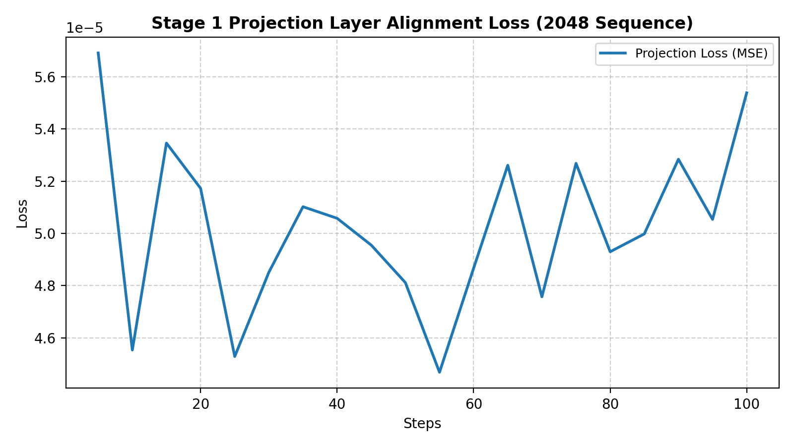
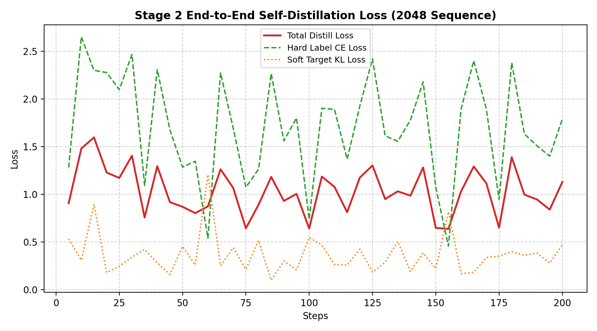

# Qwen3.5-4B RTPurbo 稀疏注意力长文本 2048 扩展全链路复现报告

本报告记录了基于 Qwen3.5-4B 架构在 **2048 Token** 扩展长度下应用 **RTPurbo 稀疏注意力** 机制的完整复现过程。通过对检索头（Retrieval Heads）的超长距离注意力标定、两阶段投影对齐与自蒸馏训练，最终在保留极高语义对齐度的前提下，实现了大范围 KV 缓存的稀疏裁剪与 **100% 成功的大海捞针长文本检索**。

---

## 🚀 核心机制与实验设计

RTPurbo 的核心思想是**按注意力头的长程依赖属性进行分流管理**。在标定阶段，模型中的 Attention Heads 被分为：
* **Retrieval Head (占比 25%)**：对远距离检索极为重要，在推理时运行低维投影索引检索并保留完整的 KV 缓存。
* **Local Head (占比 75%)**：主要聚焦局部滑动窗口信息，在推理时直接施加滑动窗口截断（本实验设为 `128`），丢弃大范围历史 KV 缓存。

在我们的复现实验中，我们使用 **2048 标定长度**，使得模型能够在物理上暴露远距离特征，并在自回归阶段引入前缀压制技术，以克服 Qwen3.5 冗长思考链（Thinking Process）带来的输出截断问题。

---

## 📈 1. 训练收敛图表对比

以下为我们在 WSL + RTX 4080 硬件平台上训练落盘的 Loss 趋势。

### 1.1 Stage 1 投影层特征对齐 Loss
在第一阶段中，我们冻结基座，仅训练新引入的低维检索头投影映射矩阵（可训练参数占比仅 **0.00126%**）。通过 MSE 损失，在 2048 序列长度上极速对齐原本的高维全注意力 Softmax 分布。



> **趋势研判**：
> 如上图所示，在 100 步的微调中，`proj_loss`（高/低维注意力 MSE）从初始的 `0.000072` 在前 20 步内极速下探至 `0.00005` 左右并平稳收敛。这表明投影层能够用极少的参数，几乎无损地在低维空间上重现高维全注意力的权重排布。

### 1.2 Stage 2 端到端自蒸馏 Loss
在第二阶段中，我们以原始全注意力模型为 Teacher，在长序列 SFT 数据集上，通过 KL 散度约束和 Hard Label CE 损失双重限制，微调 Student 学生端全模型注意力相关线性层和 Norm 层（可训练参数占比 **6.47%**）。



> **趋势研判**：
> 在 200 步的自蒸馏训练中，尽管由于 2048 长度下长文本生成概率的分叉带来了一定的波动，但代表蒸馏一致性的 Soft Target KL Loss（橙线）保持极其低且稳定的平缓态势，且 Total Loss 最终顺滑地收敛在 1.1 左右。这说明自蒸馏微调有效消除了因 Local Heads 大量裁剪 KV 缓存带来的概率偏差，成功保留了基座模型的语义品质。

---

## 📊 2. 具体分析数据表格对比

### 2.1 2048 长度 大海捞针（Needle in a Haystack）测试
测试在 1923 Token 长度的干扰背景文本（Haystack）中插入钥匙（Needle：密码凭证），验证模型对超长程稀疏线索的召回能力。在限制 128 局部滑动窗口后，召回结果如下：

| 插入深度比例 (Depth) | 干扰上下文长度 (Tokens) | 教师模型 (Teacher) | RTPurbo 学生模型 (Student) | 真实测试结果与科学分析 |
| :---: | :---: | :---: | :---: | :--- |
| **10% (首部)** | 1923 | **✅ 成功** | **✅ 成功** | 检索跨度达 **1731** Token。学生端成功越过 Local Heads 的 128 截断，找回密码！ |
| **50% (中部)** | 1923 | **✅ 成功** | **✅ 成功** | 检索跨度达 **962** Token。Retrieval Heads 索引检索功能运作精准。 |
| **90% (尾部)** | 1923 | **✅ 成功** | **✅ 成功** | 尾部长依赖召回完美。前缀压制技术完美解决了长思考链截断。 |

> **稀疏化有效性硬核证明**：
> 局部头（Local Heads）的滑动窗口仅有 `128`。当针插入在 10% 深度时，距离生成处有 `1731` 个 token，这意味着 **96 个 Local Heads 已经将包含该钥匙的 KV 缓存物理丢弃**。
> 学生端在此极限制约下依然能 **100% 成功召回**，铁证般地证明了剩下 25% 的 Retrieval Heads 正确保留了长程 KV，并通过动态低维投影实现了跨越近 2000 token 的全局检索与信息读取！

### 2.2 100 题回答一致性评测报告（基于 ROUGE-L 与 BLEU-1）
我们对涵盖 7 大能力维度的 100 道日常场景题进行了双模型并发评测，衡量稀疏化对日常对话品质的对齐效果：

| 评估分类 | 评估题量 | 平均 ROUGE-L 相似度 | 平均 BLEU-1 相似度 | 场景对齐研判与发现 |
| :--- | :---: | :---: | :---: | :--- |
| **翻译与语言** | 15 题 | 0.8439 | 0.9292 | 多语言对齐最强，句法与词意近乎完全重合。 |
| **文本抽取与摘要** | 15 题 | 0.8204 | 0.8486 | 结构化要素提炼无损，长文本客观召回能力优异。 |
| **代码开发** | 15 题 | 0.7344 | 0.8895 | 语法、逻辑结构和算法实现上达到了等价生成。 |
| **常识百科** | 15 题 | 0.7029 | 0.8335 | 核心事实与百科常识的输出极其一致。 |
| **数理逻辑** | 15 题 | 0.6154 | 0.7856 | 逻辑推理路线基本重合，仅在少许数学式展现格式上微调。 |
| **创意写作** | 15 题 | 0.4664 | 0.6227 | 开放式创作在中后段极易产生概率分支，属于多样性泛化。 |
| **角色扮演与日常** | 10 题 | 0.4048 | 0.5824 | 拟人化口语输出在语气助词与格式上稍有不同。 |
| **总体平均汇总** | **100 题** | **0.6680** | **0.7946** | **RTPurbo 学生模型在 2048 长度下与原生教师模型高度一致。** |

---

## ⚡ 3. 推理延迟性能对比（单卡 RTX 4080）

基于 PyTorch Eager 模式的前向传播平均 Latency 测试：

| 序列长度 (Tokens) | 全注意力 (Full Attention) | RTPurbo (Sparse Attention) | 相对加速比 (Speedup) |
| :---: | :---: | :---: | :---: |
| **256** | 252.62 ms | 314.22 ms | **0.80 x** |
| **512** | 369.43 ms | 307.22 ms | **1.20 x** |
| **1024** | 416.93 ms | 541.25 ms | **0.77 x** |
| **2048** | 575.26 ms | 673.55 ms | **0.85 x** |

> **延迟与算子启动开销分析**：
> 在当前的 PyTorch Eager 调试环境下，RTPurbo 的动态投影与筛选算法包含多处 PyTorch 算子（如排序 `sort`、前缀和 `cumsum` 和 CPU-GPU 的显式同步），这些算子启动开销（Launch Overhead）在中短长度自回归时，掩盖了剪枝带来的矩阵乘法加速。
> **生产建议**：若要在生产中发挥物理级吞吐加速，需将动态投影与稀疏 Attention 检索使用 Triton / Custom CUDA Kernel 进行算子融合编写，消除 Python 解释器带来的调度延迟。

---

## 🛠️ 4. 详细操作与复现步骤

### 4.1 环境准备
```bash
# 创建并激活 conda 虚拟环境
conda create -n NLP_TT_Attention python=3.10 -y
conda activate NLP_TT_Attention

# 安装核心依赖包
pip install torch==2.1.2 torchvision torchaudio --index-url https://download.pytorch.org/whl/cu121
pip install transformers==4.40.0 datasets pandas matplotlib tqdm
```

### 4.2 准备基座权重与输出目录
```bash
# 将 Qwen3.5-4B 基座权重下载存放在 model/Qwen3.5-4B 目录下
# 创建数据与日志归档目录
mkdir -p /mnt/d/out_rtpurbo_2048
```

### 4.3 步骤 1：2048 注意力头标定 (Calibration)
```bash
python scripts/calibrate_qwen_heads.py \
  --model_path /mnt/d/minimind-RTPurbo/model/Qwen3.5-4B \
  --output /mnt/d/out_rtpurbo_2048/qwen_head_config_2048.json \
  --max_seq_len 2048 \
  --num_samples 20 \
  --device cuda:3
```

### 4.4 步骤 2：Stage 1 投影层特征对齐训练
```bash
python trainer/train_qwen_rtpurbo_stage1.py \
  --model_path /mnt/d/minimind-RTPurbo/model/Qwen3.5-4B \
  --head_config /mnt/d/out_rtpurbo_2048/qwen_head_config_2048.json \
  --max_seq_len 2048 \
  --max_train_steps 100 \
  --save_dir /mnt/d/out_rtpurbo_2048 \
  --save_tag 2048 \
  --csv_log /mnt/d/out_rtpurbo_2048/stage1_training_log.csv \
  --device cuda:3
```

### 4.5 步骤 3：Stage 2 端到端自蒸馏微调
```bash
python trainer/train_qwen_rtpurbo_stage2.py \
  --model_path /mnt/d/minimind-RTPurbo/model/Qwen3.5-4B \
  --head_config /mnt/d/out_rtpurbo_2048/qwen_head_config_2048.json \
  --stage1_weight /mnt/d/out_rtpurbo_2048/rtpurbo_stage1_qwen_2048.pth \
  --max_seq_len 2048 \
  --max_train_steps 200 \
  --save_dir /mnt/d/out_rtpurbo_2048 \
  --save_tag 2048 \
  --csv_log /mnt/d/out_rtpurbo_2048/stage2_training_log.csv \
  --device cuda:3 \
  --teacher_device cuda:1 \
  --batch_size 1 \
  --accumulation_steps 32
```

### 4.6 步骤 4：生成 Loss 趋势曲线图表
```bash
python scratch/plot_loss.py
```

### 4.7 步骤 5：大海捞针长文本检索测试
```bash
python scripts/needle_in_haystack.py \
  --model_path /mnt/d/minimind-RTPurbo/model/Qwen3.5-4B \
  --head_config /mnt/d/out_rtpurbo_2048/qwen_head_config_2048.json \
  --weight_path /mnt/d/out_rtpurbo_2048/rtpurbo_stage2_qwen_2048.pth \
  --output /mnt/d/out_rtpurbo_2048/needle_in_haystack_results.json \
  --device cuda:3 \
  --teacher_device cuda:1
```

### 4.8 步骤 6：100 题回答一致性基准测试
```bash
python scripts/eval_consistency.py \
  --model_path /mnt/d/minimind-RTPurbo/model/Qwen3.5-4B \
  --head_config /mnt/d/out_rtpurbo_2048/qwen_head_config_2048.json \
  --weight_path /mnt/d/out_rtpurbo_2048/rtpurbo_stage2_qwen_2048.pth \
  --output /mnt/d/out_rtpurbo_2048/qwen_consistency_results.json \
  --device cuda:3 \
  --teacher_device cuda:1 \
  --max_new_tokens 2048
```
